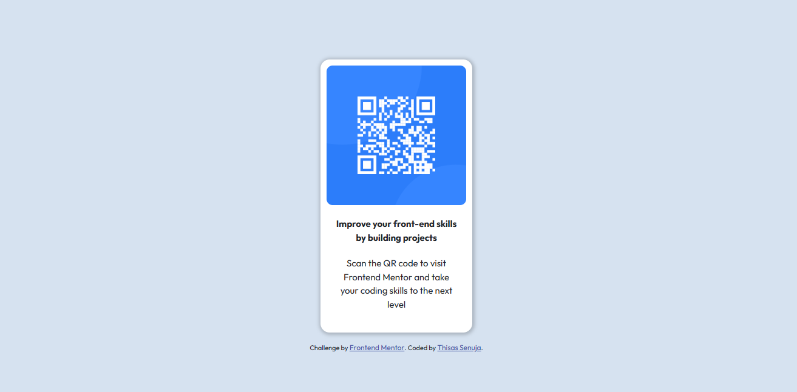

# Frontend Mentor - QR code component solution

This is a solution to the [QR code component challenge on Frontend Mentor](https://www.frontendmentor.io/challenges/qr-code-component-iux_sIO_H). Frontend Mentor challenges help you improve your coding skills by building realistic projects. 

## Table of contents

- [Overview](#overview)
  - [Screenshot](#screenshot)
- [My process](#my-process)
  - [Built with](#built-with)
  - [What I learned](#what-i-learned)
  - [Continued development](#continued-development)
  - [Useful resources](#useful-resources)
- [Author](#author)
- [Acknowledgments](#acknowledgments)

**Note: Delete this note and update the table of contents based on what sections you keep.**

## Overview

### Screenshot



## My process

### Built with

- Semantic HTML5 markup
- CSS custom properties
- Flexbox
- CSS Grid
- [bootstrap.min.css](https://getbootstrap.com/) - Bootstrap Framework

### What I learned

Mainly I learnt to center a .div at the middle of the screen and also to add the website icon.

```html
<link rel="icon" type="image/png" sizes="32x32" href="./images/favicon-32x32.png">
```
```css
body{
    display: flex;
    align-items: center;
    justify-content: center;
}
.d-flex{
    height: 100vh;
}
```

## Author
- Frontend Mentor - [@yourusername](https://www.frontendmentor.io/profile/ThisasSenuja)
